# moa — Multi-Agent Orchestrator for Go

[](https://pkg.go.dev/github.com/formonkey/moa)
[](https://go.dev)
[](LICENSE)
[](https://goreportcard.com/report/github.com/formonkey/moa)

Build production-grade AI agents in Go. moa gives you composable agents, tool orchestration, lazy tool loading, code graph awareness, security sandboxing, guardrails, observability, swarm coordination, skill optimization, RAG, A2A protocol support, and SSE streaming — all in pure Go with zero heavy dependencies.

> **Keywords:** Go AI framework, LLM orchestrator, multi-agent system, Golang AI agents, OpenAI Go SDK, Gemini Go, Ollama Go, RAG Go, agent framework, agentic AI

## Quick Start

```go
package main

import (
    "context"
    "fmt"

    "github.com/formonkey/moa/agent/llmagent"
    "github.com/formonkey/moa/model/gemini"
    "github.com/formonkey/moa/runner"
    "github.com/formonkey/moa/session"

    "google.golang.org/genai"
)

func main() {
    ctx := context.Background()

    agent, _ := llmagent.New(llmagent.Config{
        Name:        "assistant",
        Model:       gemini.New("gemini-2.5-flash"),
        Instruction: "You are a helpful assistant.",
    })

    r, _ := runner.New(runner.Config{
        AppName:           "my-app",
        Agent:             agent,
        SessionService:    session.InMemoryService(),
        AutoCreateSession: true,
    })
    defer r.Close()

    msg := genai.NewContentFromText("Hello!", "user")
    for event, err := range r.Run(ctx, "user1", "session1", msg, agent.RunConfig{}) {
        if err != nil { panic(err) }
        if event != nil && event.Content != nil {
            for _, p := range event.Content.Parts {
                fmt.Print(p.Text)
            }
        }
    }
}
```

## Full Example: 3-Agent Dev Team

A complete, runnable example: **Tech Lead** (Gemini) coordinates **Frontend Dev** (local Qwen) and **Backend Dev** (local Qwen). Uses every major feature of the library.

```
                    ┌─────────────────────────────┐
                    │   Tech Lead (Gemini)        │
                    │   • RAG docs search         │
                    │   • Scraper                 │
                    │   • Cost Governor 200K/10m  │
                    │   • Circuit Breaker         │
                    │   • Teacher → GPT-4o        │
                    │   • Security sandbox        │
                    │   • Guardrails (PII+inject) │
                    └─────────┬───────────────────┘
                              │ delegates via sub_agents
               ┌──────────────┴──────────────┐
               ▼                             ▼
┌──────────────────────────┐  ┌──────────────────────────┐
│ Frontend Dev (Qwen 8B)   │  │ Backend Dev (Qwen 8B)    │
│ • Toolbox: files, system │  │ • Toolbox: files, system │
│ • CodeGraph (React)      │  │ • CodeGraph (Go)         │
│ • React Skill bundle     │  │ • Go Skill bundle        │
│ • Cost Governor 80K/3m   │  │ • Scraper                │
│ • Circuit Breaker        │  │ • Cost Governor 80K/3m   │
│ • output_key →           │  │ • Circuit Breaker        │
│   "frontend_changes"     │  │ • Teacher → Gemini       │
│ • No peer transfer       │  │ • output_key →           │
└──────────────────────────┘  │   "backend_changes"      │
                              │ • No peer transfer       │
                              └──────────────────────────┘
```

### Example 1: YAML (single file, 3 agents)

> Full source: [`examples/dev-team-yaml/`](examples/dev-team-yaml/)

**`dev-team.yaml`** — All 3 agents in one file using `inline`:

```yaml
name: tech-lead
model: gemini-2.5-flash
provider: gemini

instruction: |
  You are a Senior Tech Lead. Your team:
  - 'frontend-dev': React/TypeScript specialist
  - 'backend-dev': Go API specialist
  Analyze requests, delegate to specialists, review their work.

tools:
  - name: scrape_url
  - name: codegraph
    args: { project_dir: "./" }

output_key: "tech_lead_summary"

plugins:
  - name: cost-governor
    args:
      max_total_tokens: 200000
      max_wall_time: "10m"
      tool_call_caps: { run_command: 20, write_file: 30 }
  - name: circuit-breaker
    args: { max_identical_calls: 5, max_consecutive_fails: 5 }
  - name: teacher-escalation
    args: { teacher_model: gpt-4o, teacher_provider: openai }

sub_agents:

  - inline:
      name: frontend-dev
      model: qwen3:8b
      provider: ollama
      instruction: |
        Senior Frontend Dev (React + TypeScript).
        Read code first, follow patterns, write typed components.
        Transfer back to 'tech-lead' when done.
      tools:
        - name: devtools
          args: { project_dir: "./frontend" }
        - name: codegraph
          args: { project_dir: "./frontend" }
      output_key: "frontend_changes"
      disallow_transfer_to_peers: true
      plugins:
        - name: cost-governor
          args: { max_total_tokens: 80000, max_wall_time: "3m" }
        - name: circuit-breaker

  - inline:
      name: backend-dev
      model: qwen3:8b
      provider: ollama
      instruction: |
        Senior Backend Dev (Go). Write idiomatic Go with proper
        error handling and table-driven tests. Run 'go test' before
        reporting back. Transfer to 'tech-lead' when done.
      tools:
        - name: devtools
          args: { project_dir: "./backend" }
        - name: codegraph
          args: { project_dir: "./backend" }
        - name: scrape_url
      output_key: "backend_changes"
      disallow_transfer_to_peers: true
      plugins:
        - name: cost-governor
          args: { max_total_tokens: 80000, max_wall_time: "3m" }
        - name: circuit-breaker
        - name: teacher-escalation
          args: { teacher_model: gemini-2.5-flash, teacher_provider: gemini }
```

**`main.go`** — Load and run:

```go
func main() {
    ctx := context.Background()

    // Load entire 3-agent tree from ONE yaml file
    techLead, _ := configurable.FromConfig(ctx, "./dev-team.yaml")
    plugins, _ := configurable.PluginsFromConfig(ctx, "./dev-team.yaml")

    // Add RAG + security + guardrails on top
    ragStore, _ := rag.NewStore("./.moa_rag")
    ragStore.IndexFile("./docs/architecture.md")

    allPlugins := append(plugins,
        security.NewPlugin(security.Standard("./")),
        guardrail.NewPlugin(
            guardrail.PromptInjection(),
            guardrail.PII(guardrail.PIIConfig{
                Block: []guardrail.PIIType{guardrail.PIICreditCard},
            }),
        ),
    )

    r, _ := runner.New(runner.Config{
        AppName:           "dev-team",
        Agent:             techLead,
        Plugins:           allPlugins,
        SessionService:    session.InMemoryService(),
        AutoCreateSession: true,
    })

    msg := genai.NewContentFromText("Add a user profile page with a REST API", "user")
    for event, _ := range r.Run(ctx, "dev", "s1", msg, agent.RunConfig{}) {
        if event != nil && event.Content != nil {
            for _, p := range event.Content.Parts { fmt.Print(p.Text) }
        }
    }
}
```

---

### Example 2: Pure Go (no YAML)

> Full source: [`examples/dev-team-go/`](examples/dev-team-go/)

```go
func main() {
    ctx := context.Background()

    // ── Skills ──
    goSkill := &skill.SimpleSkill{
        SkillName: "go_best_practices",
        Directive: "Use error wrapping, interfaces, table-driven tests...",
    }
    reactSkill := &skill.SimpleSkill{
        SkillName: "react_best_practices",
        Directive: "Use functional components, typed Props, error boundaries...",
    }
    skillRegistry := skill.NewRegistry()
    skillRegistry.Register(goSkill)
    skillRegistry.Register(reactSkill)

    // ── RAG ──
    ragStore, _ := rag.NewStore("./.moa_rag")
    ragStore.IndexFile("./docs/architecture.md")
    ragTool, _ := rag.NewSearchDocsTool(ragStore)

    // ── Toolboxes (lazy loading) ──
    frontendTb := toolbox.New()
    frontendTb.Register("files", "Read/write/edit", devtools.ReadFile(), devtools.WriteFile())
    frontendTb.Register("system", "Run commands", devtools.RunCommand())

    backendTb := toolbox.New()
    backendTb.Register("files", "Read/write/edit", devtools.ReadFile(), devtools.WriteFile())
    backendTb.Register("code_intel", "Code search", codegraph.SearchTool("./backend"))

    // ── Agents ──
    frontendDev, _ := llmagent.New(llmagent.Config{
        Name:        "frontend-dev",
        Model:       ollama.New("qwen3:8b"),
        Instruction: "Senior React/TS dev. Read code first, write typed components...",
        Toolsets:    []tool.Toolset{frontendTb, reactSkill},
        OutputKey:   "frontend_changes",
        DisallowTransferToPeers: true,
    })

    backendDev, _ := llmagent.New(llmagent.Config{
        Name:        "backend-dev",
        Model:       ollama.New("qwen3:8b"),
        Instruction: "Senior Go dev. Idiomatic Go, run tests before reporting...",
        Toolsets:    []tool.Toolset{backendTb, goSkill},
        Tools:       []tool.Tool{scraper.New(15 * time.Second)},
        OutputKey:   "backend_changes",
        DisallowTransferToPeers: true,
    })

    techLead, _ := llmagent.New(llmagent.Config{
        Name:        "tech-lead",
        Model:       gemini.New("gemini-2.5-flash"),
        Instruction: "Senior Tech Lead. Delegate to frontend-dev and backend-dev...",
        Tools:       []tool.Tool{ragTool, scraper.New(30 * time.Second)},
        SubAgents:   []agent.Agent{frontendDev, backendDev},
        OutputKey:   "tech_lead_summary",
    })

    // ── Plugins ──
    plugins := []*plugin.Plugin{
        costgovernor.New(costgovernor.Config{
            MaxTotalTokens: 200_000,
            MaxWallTime:    10 * time.Minute,
            ToolCallCaps:   map[string]int{"run_command": 20},
        }),
        circuitbreaker.New(circuitbreaker.Config{
            MaxIdenticalCalls: 5, MaxConsecutiveFails: 5,
        }),
        teacherescalation.New(teacherescalation.Config{
            TeacherModel:  openai.New("gpt-4o"),
            SkillRegistry: skillRegistry,
        }),
        security.NewPlugin(security.Standard("./")),
        guardrail.NewPlugin(
            guardrail.PromptInjection(),
            guardrail.PII(guardrail.PIIConfig{
                Block: []guardrail.PIIType{guardrail.PIICreditCard},
            }),
        ),
    }

    // ── Run ──
    r, _ := runner.New(runner.Config{
        Agent: techLead, Plugins: plugins,
        SessionService: session.InMemoryService(), AutoCreateSession: true,
    })

    msg := genai.NewContentFromText("Add a user profile page with a REST API", "user")
    for event, _ := range r.Run(ctx, "dev", "s1", msg, agent.RunConfig{}) {
        if event != nil && event.Content != nil {
            for _, p := range event.Content.Parts { fmt.Print(p.Text) }
        }
    }
}
```

## Architecture

```mermaid
graph TB
    subgraph "Runner"
        R[Runner] --> PM[Plugin Manager]
        R --> SS[Session Service]
        R --> STR[SSE Streaming]
    end

    subgraph "Plugins"
        PM --> SEC[Security]
        PM --> GRD[Guardrails]
        PM --> OTL[OpenTelemetry]
        PM --> CG_P[Cost Governor]
        PM --> CB_P[Circuit Breaker]
        PM --> TE_P[Teacher Escalation]
        PM --> RR_P[Retry & Reflect]
    end

    subgraph "Agent Tree"
        R --> LA[LLM Agent]
        R --> SA[Sequential Agent]
        R --> PA[Parallel Agent]
        R --> LOA[Loop Agent]
        R --> CA[Competitive Agent]
        R --> DA[Debate Agent]
    end

    subgraph "Tool Layer"
        LA --> TB[Toolbox]
        LA --> DT[Dev Tools]
        LA --> CGT[Code Graph]
        LA --> FT[Function Tools]
        LA --> MCP[MCP Tools]
        LA --> GT[Git Tools]
        LA --> WT[Web Tools]
    end

    subgraph "Model Providers"
        LA --> GEM[Gemini]
        LA --> OAI[OpenAI]
        LA --> ANT[Anthropic]
        LA --> OLL[Ollama]
        LA --> MORE["+6 more"]
    end

    subgraph "Knowledge"
        R --> RAG[RAG Store]
        R --> MEM[Memory]
        R --> SK[Skills]
        R --> SKOPT[Skill Optimizer]
    end

    subgraph "Interop"
        R --> A2A[A2A Protocol]
    end

    subgraph "Multi-Agent"
        R --> SW[Swarm]
        SW --> BB[Blackboard]
        SW --> SCH[Scheduler]
        SW --> FSM[FSM Agent]
    end
```




---

## Table of Contents

- [Agents](#-agents)
- [Tools](#-tools)
- [Toolbox (Lazy Loading)](#-toolbox-lazy-tool-loading)
- [Plugins](#-plugins)
  - [Cost Governor](#cost-governor)
  - [Circuit Breaker](#circuit-breaker)
  - [Teacher Escalation](#teacher-escalation)
  - [Context Budget](#context-budget)
  - [Retry & Reflect](#retry--reflect)
  - [Security](#-security)
  - [Guardrails](#️-guardrails)
  - [OpenTelemetry](#-opentelemetry-tracing)
- [Model Providers](#-multi-provider-10-models)
- [YAML Configuration](#-yaml-configuration)
- [Developer Agent](#-developer-agent)
- [RAG (Document Search)](#-rag-document-search)
- [Memory](#-memory)
- [Skills & Skill Optimizer](#-skills--skill-optimizer)
- [Eval (Testing Framework)](#-eval-testing-framework)
- [Swarm Coordination](#-swarm-coordination)
- [A2A Protocol](#-a2a-protocol)
- [SSE Streaming](#-sse-streaming)
- [Comparison](#comparison)

---

## 🤖 Agents

| Agent Type | Package | Description |
|------------|---------|-------------|
| `LlmAgent` | `agent/llmagent` | LLM-powered agent with tools, callbacks, and streaming |
| `SequentialAgent` | `agent/workflowagents/sequentialagent` | Runs sub-agents in order, piping output to next |
| `ParallelAgent` | `agent/workflowagents/parallelagent` | Runs sub-agents concurrently, merges results |
| `LoopAgent` | `agent/workflowagents/loopagent` | Repeats a sub-agent until a condition is met |
| `CompetitiveAgent` | `agent/workflowagents/competitiveagent` | Races sub-agents, picks best answer via voting |
| `DebateAgent` | `agent/workflowagents/debateagent` | Sub-agents debate and reach consensus |

```go
// LLM Agent
agent, _ := llmagent.New(llmagent.Config{
    Name:        "coder",
    Model:       gemini.New("gemini-2.5-flash"),
    Instruction: "You are a Go expert.",
    Tools:       []tool.Tool{runCmd, readFile, writeFile},
    SubAgents:   []agent.Agent{reviewer},
})

// Sequential pipeline
pipeline, _ := sequentialagent.New(sequentialagent.Config{
    Name:      "code-review-pipeline",
    SubAgents: []agent.Agent{analyzer, reviewer, reporter},
})

// Parallel execution
parallel, _ := parallelagent.New(parallelagent.Config{
    Name:      "multi-analysis",
    SubAgents: []agent.Agent{securityAudit, perfAudit, styleAudit},
})
```

---

## 🔧 Tools

| Tool | Package | Description |
|------|---------|-------------|
| `FunctionTool` | `tool/functiontool` | Type-safe Go generic function tools |
| `DevTools` | `tool/devtools` | Read/write/edit files, run commands |
| `CodeGraph` | `tool/codegraph` | Semantic code search & navigation |
| `GitTools` | `tool/gittools` | Git operations (status, diff, commit) |
| `WebTools` | `tool/webtools` | HTTP requests, web scraping |
| `Scraper` | `tool/scraper` | URL content extraction |
| `MCP` | `tool/mcp` | Model Context Protocol client |
| `Toolbox` | `tool/toolbox` | Lazy tool discovery & activation |
| `CostTracker` | `tool/costtracker` | Token & cost tracking |
| `TaskBoard` | `tool/taskboard` | Task management for agents |
| `Learnings` | `tool/learnings` | Persistent learnings storage |

```go
// Define tools with type-safe Go generics
tool, _ := functiontool.New(functiontool.Config{
    Name:        "get_weather",
    Description: "Get weather for a city",
}, func(ctx context.Context, args struct {
    City string `json:"city"`
}) (map[string]any, error) {
    return map[string]any{"temp": 22, "unit": "C"}, nil
})
```

---

## 📦 Toolbox (Lazy Tool Loading)

**This is moa's killer feature.** Instead of giving the model all tools upfront (consuming context), the toolbox lets agents discover and activate tools on demand:

```go
tb := toolbox.New()
tb.Register("file_ops", "Read, write, edit files", readFile, writeFile, editFile)
tb.Register("code_intel", "Code graph search", codegraphSearch, codegraphExplore)
tb.Register("system", "Run commands", runCommand)

// Agent starts with just 1 tool: discover_tools
// When the model needs file operations, it calls discover_tools("file_ops")
// Only then are those tools activated and available

// Context usage: ~2,000 tokens → ~400 tokens (80% reduction)
```

No other agent framework has this. See [docs/toolbox.md](docs/toolbox.md).

---

## 🔌 Plugins

moa has a powerful plugin system that intercepts the agent lifecycle at 6 hook points:

| Hook | When | Use Case |
|------|------|----------|
| `BeforeModelCallback` | Before every LLM call | Budget checks, input filtering |
| `AfterModelCallback` | After every LLM response | Response filtering, escalation |
| `BeforeToolCallback` | Before every tool call | Permissions, rate limiting |
| `AfterToolCallback` | After every tool result | Logging, cost tracking |
| `OnToolErrorCallback` | On tool failure | Retry logic, circuit breaking |
| `BeforeAgentCallback` / `AfterAgentCallback` | Agent lifecycle | Tracing, audit |

### Cost Governor

Multi-layered budget enforcement for agents. Prevents runaway loops from burning through API credits or GPU time.

```go
gov := costgovernor.New(costgovernor.Config{
    // Token budget (local + cloud)
    MaxTotalTokens:      100_000,

    // Wall time budget (ideal for local models)
    MaxWallTime:         5 * time.Minute,

    // Dollar budget (cloud models)
    MaxDollarBudget:     0.50,
    PricePerInputToken:  0.00000015,
    PricePerOutputToken: 0.0000006,

    // Per-tool call caps
    ToolCallCaps: map[string]int{
        "run_command": 10,
        "write_file":  20,
    },

    // Financial velocity limit
    MaxDollarsPerMinute: 0.10,
})
```

Errors: `ErrBudgetExhausted`, `ErrDollarBudget`, `ErrToolCapExceeded`, `ErrVelocityLimit`, `ErrWallTimeExceeded`

**Local model config** (no dollar fields needed):

```yaml
plugins:
  - name: cost-governor
    args:
      max_total_tokens: 100000
      max_wall_time: "5m"
      tool_call_caps:
        run_command: 10
```

### Circuit Breaker

Detects and stops infinite loops, repetitive tool calls, and cascading failures.

```go
cb := circuitbreaker.New(circuitbreaker.Config{
    MaxIdenticalCalls:   5,              // Trip after 5 identical tool calls
    MaxConsecutiveFails: 5,              // Trip after 5 consecutive failures
    CooldownDuration:   30 * time.Second, // Wait before allowing probes
    MaxProbes:          2,               // Probe attempts in half-open state
    KillSwitch:         &circuitbreaker.AtomicKillSwitch{},
})
```

**3-state machine:** Closed → Open → HalfOpen

| State | Behavior |
|-------|----------|
| **Closed** | Normal operation, counting failures |
| **Open** | All calls blocked with `ErrCircuitOpen` |
| **HalfOpen** | After cooldown, allows N probe calls to test recovery |

**Kill Switch options:**

```go
// In-memory (API-driven)
ks := &circuitbreaker.AtomicKillSwitch{}
ks.Trip()   // Emergency stop
ks.Reset()  // Resume

// File-based (touch /tmp/moa_kill to stop)
ks := &circuitbreaker.FileKillSwitch{Path: "/tmp/moa_kill"}
```

### Teacher Escalation

Self-improving agents: when a local model fails, escalates to a more capable "teacher" model that answers AND generates reusable skills.

```go
escalation := teacherescalation.New(teacherescalation.Config{
    TeacherModel:  openai.New("gpt-4o"),     // or another local model!
    SkillRegistry: skill.NewRegistry(),
    MinConfidence: 0.6,                       // Only persist high-quality skills
})
```

**Flow:** Student fails → Failure detected (regex) → Teacher called → Answer returned → Skill generated → Skill persisted → Student uses skill next time

**Failure detection patterns:**
- Tool errors: `"Unknown action"`, `"Failed to"`, `"not found"`, `"error:"`
- Give-up replies: `"I can't do"`, `"I'm not able"`, `"beyond my capabilities"`

**The teacher can be local too:**

| Setup | Student | Teacher |
|-------|---------|---------|
| Cloud escalation | Qwen-8B | GPT-4o |
| Local escalation | Qwen-8B (fast) | Llama-70B (capable) |
| Same hardware | Model Q4 | Same model FP16 |

### Context Budget

Adaptive input token budget built into `RunConfig`:

```go
config := &agent.RunConfig{
    InputTokenBudget:    50_000,
    InputTokenBudgetSet: true,
}

// Auto-compute: 85% of model context window, capped at 200K
budget := config.EffectiveInputBudget(8192)      // Qwen-8B → 6,963
budget = config.EffectiveInputBudget(128_000)     // Gemma-128K → 108,800
budget = config.EffectiveInputBudget(1_000_000)   // Gemini-1M → 200,000 (capped)
```

### Retry & Reflect

Automatic retry with LLM self-reflection on failures:

```go
import "github.com/formonkey/moa/plugin/retryandreflect"

plug := retryandreflect.New(retryandreflect.Config{
    MaxRetries: 3,
})
```

### 🔒 Security

Sandbox agent execution with declarative policies:

```go
policy := security.Standard("./my-project")
plug := security.NewPlugin(policy)

runner, _ := runner.New(runner.Config{
    Agent:   myAgent,
    Plugins: []*plugin.Plugin{plug},
})
```

| Preset | Blocks | HITL | Use Case |
|--------|--------|------|----------|
| `Standard` | `rm -rf`, writes outside project, `/etc` access | Destructive commands | Development |
| `Strict` | Everything above + all commands need approval | All tool calls | Production |
| `Permissive` | Nothing | Nothing | Trusted environments |

See [docs/security.md](docs/security.md).

### 🛡️ Guardrails

Protect against prompt injection, PII leaks, and unwanted content:

```go
plug := guardrail.NewPlugin(
    guardrail.PromptInjection(),     // Blocks "ignore previous instructions" etc.
    guardrail.PII(guardrail.PIIConfig{
        Block:    []guardrail.PIIType{guardrail.PIISSN, guardrail.PIICreditCard},
        Sanitize: []guardrail.PIIType{guardrail.PIIEmail, guardrail.PIIPhone},
    }),
    guardrail.ContentPolicy(guardrail.ContentConfig{
        BlockPatterns: []string{`DROP TABLE`, `DELETE FROM`},
        MaxOutputLen:  10000,
    }),
    guardrail.Keywords(guardrail.KeywordsConfig{
        Block: []string{"competitor-name"},
    }),
)
```

| Guardrail | Input | Output | Action |
|-----------|-------|--------|--------|
| `PromptInjection()` | ✅ | — | Block (15 patterns) |
| `PII()` | ✅ | ✅ | Block or Sanitize |
| `ContentPolicy()` | ✅ | ✅ | Block/Warn |
| `Keywords()` | ✅ | ✅ | Block/Sanitize |

### 📊 OpenTelemetry Tracing

Full observability with zero config:

```go
import "github.com/formonkey/moa/plugin/otelplugin"

plug := otelplugin.New(otelplugin.Config{
    Tracer:       otel.Tracer("my-agent"),
    RecordTokens: true,
})
```

Produces spans for the entire pipeline:

```
[trace] agent.run
  └─ agent.invoke
       ├─ agent.model_call (model, tokens, finish_reason, duration_ms)
       ├─ agent.tool_call (tool.name, tool.args.*, duration_ms)
       ├─ agent.model_call
       └─ agent.tool_call
```

---

## 🔌 Multi-Provider (10 models)

```go
// Cloud providers
geminiModel, _ := gemini.NewClient(ctx, os.Getenv("GEMINI_API_KEY"), "gemini-2.5-flash")
openaiModel := openai.NewClient(openai.Config{Model: "gpt-4o"})
anthropicModel := anthropic.NewClient(anthropic.Config{Model: "claude-sonnet-4-20250514"})

// Local models (Ollama)
localModel := ollama.NewClient("", "qwen3:8b")  // localhost:11434

// Other cloud providers
deepseekModel := deepseek.NewClient(deepseek.Config{Model: "deepseek-chat"})
groqModel := groq.NewClient(groq.Config{Model: "llama3-70b"})
```

All providers implement the same `model.LLM` interface:

```go
type LLM interface {
    Name() string
    GenerateContent(ctx context.Context, req *LLMRequest, stream bool) iter.Seq2[*LLMResponse, error]
}
```

### Ollama Connection

moa auto-detects your Ollama installation. Priority: **explicit endpoint > `OLLAMA_HOST` env > `localhost:11434`**

```go
// Default: localhost:11434
model := ollama.NewClient("", "qwen3:8b")

// Docker or remote server — uses OLLAMA_HOST env var automatically
// export OLLAMA_HOST=http://gpu-server:11434
model := ollama.NewClient("", "qwen3:8b")  // picks up OLLAMA_HOST

// Explicit endpoint (overrides everything)
model := ollama.NewClient("http://192.168.1.50:11434", "qwen3:8b")
```

Via YAML — use the `endpoint` field:

```yaml
name: my-agent
model: qwen3:8b
provider: ollama
endpoint: "http://gpu-server:11434"   # Optional, defaults to OLLAMA_HOST or localhost
```

### YAML Connection Config

All model connection details can be set from YAML:

```yaml
# Cloud model with API key from env var
name: tech-lead
model: gemini-2.5-flash
provider: gemini
api_key: "${GEMINI_API_KEY}"          # Resolves env vars automatically

# Local model with custom endpoint
name: backend-dev
model: qwen3:8b
provider: ollama
endpoint: "http://gpu-server:11434"   # Docker, remote, or custom port

# Teacher with custom endpoint
plugins:
  - name: teacher-escalation
    args:
      teacher_model: gpt-4o
      teacher_provider: openai
      teacher_api_key: "${OPENAI_API_KEY}"
      teacher_endpoint: "https://custom-proxy.com/v1"
```

| YAML Field | Where | Description |
|------------|-------|-------------|
| `endpoint` | Agent | Base URL for model API |
| `api_key` | Agent | API key, supports `${ENV_VAR}` syntax |
| `teacher_endpoint` | teacher-escalation plugin | Base URL for teacher model |
| `teacher_api_key` | teacher-escalation plugin | API key for teacher model |

---

## 📋 YAML Configuration

Define agents, tools, and plugins declaratively:

```yaml
name: my-coding-agent
model: gemini-2.5-flash
provider: gemini
instruction: "Expert Go developer"

tools:
  - name: scrape_url
    args:
      timeout: "30s"
  - name: codegraph
    args:
      project_dir: "./"

plugins:
  - name: cost-governor
    args:
      max_total_tokens: 100000
      max_wall_time: "5m"
      tool_call_caps:
        run_command: 10
  - name: circuit-breaker
    args:
      max_identical_calls: 5
      max_consecutive_fails: 5
      cooldown_duration: "30s"
  - name: teacher-escalation
    args:
      teacher_model: gpt-4o
      teacher_provider: openai
      min_confidence: 0.6
```

```go
// Load agent + plugins from YAML
agent, _ := configurable.FromConfig(ctx, "./agent.yaml")
plugins, _ := configurable.PluginsFromConfig(ctx, "./agent.yaml")

r, _ := runner.New(runner.Config{
    Agent:   agent,
    Plugins: plugins,
})
```

### Multi-Agent Communication via YAML

Agents reference each other via `sub_agents` with relative `config_path`. Each agent is its own YAML file:

```
agents/
├── orchestrator.yaml    # Parent — delegates to children
├── coder.yaml           # Writes code
├── reviewer.yaml        # Reviews code
└── tester.yaml          # Runs tests
```

**`agents/coder.yaml`** — A coding agent:

```yaml
name: coder
model: qwen3:8b
provider: ollama
instruction: |
  You are a Go developer. Write clean, tested code.
  When done, transfer to 'reviewer' for code review.
tools:
  - name: devtools
    args:
      project_dir: "./"
output_key: "code_output"    # Saves output to session state
```

**`agents/reviewer.yaml`** — Reviews the coder's work:

```yaml
name: reviewer
model: gemini-2.5-flash
provider: gemini
instruction: |
  You are a senior code reviewer. Review the code written by 'coder'.
  Check for bugs, security issues, and Go best practices.
  When done, transfer to 'tester' to validate.
```

**`agents/tester.yaml`** — Runs tests:

```yaml
name: tester
model: qwen3:8b
provider: ollama
instruction: |
  You are a test engineer. Run the tests and report results.
  Use run_command to execute 'go test ./...'.
tools:
  - name: devtools
    args:
      project_dir: "./"
disallow_transfer_to_peers: true   # Stops the chain here
```

#### LLM Agent with Sub-Agents (Delegation)

The orchestrator delegates to specialists. The LLM decides who to call:

```yaml
# agents/orchestrator.yaml
name: orchestrator
model: gemini-2.5-flash
provider: gemini
instruction: |
  You coordinate a development team:
  - 'coder' writes code
  - 'reviewer' reviews it
  - 'tester' runs tests
  Delegate tasks to the right specialist.

sub_agents:
  - config_path: coder.yaml      # Relative to this file
  - config_path: reviewer.yaml
  - config_path: tester.yaml
```

#### Sequential Pipeline

Agents run one after another, output piped to the next:

```yaml
# agents/pipeline.yaml
name: code-review-pipeline
agent_class: SequentialAgent

sub_agents:
  - config_path: coder.yaml       # Step 1: Write code
  - config_path: reviewer.yaml    # Step 2: Review it
  - config_path: tester.yaml      # Step 3: Test it
```

#### Parallel Execution

All agents run concurrently, results merged:

```yaml
# agents/multi-audit.yaml
name: multi-audit
agent_class: ParallelAgent

sub_agents:
  - config_path: security-auditor.yaml    # Runs simultaneously
  - config_path: perf-auditor.yaml
  - config_path: style-auditor.yaml
```

#### Loop Agent

Repeats a sub-agent until it returns a stop signal:

```yaml
# agents/iterative-fixer.yaml
name: fix-loop
agent_class: LoopAgent
max_iterations: 5

sub_agents:
  - config_path: coder.yaml    # Keeps fixing until tests pass
```

#### Loading Multi-Agent Systems

```go
// One line — resolves the entire agent tree recursively
agent, _ := configurable.FromConfig(ctx, "./agents/orchestrator.yaml")
// orchestrator → coder, reviewer, tester (all resolved from YAML)

// Or load a pipeline
pipeline, _ := configurable.FromConfig(ctx, "./agents/pipeline.yaml")
```

### Extensible Registry

Register your own factories:

```go
configurable.RegisterPluginFactory("my-plugin", func(ctx context.Context, args map[string]any) (*plugin.Plugin, error) {
    return myPlugin(args), nil
})

configurable.RegisterToolFactory("my-tool", func(ctx context.Context, args map[string]any) (tool.Tool, error) {
    return myTool(args), nil
})

configurable.SetModelResolver(func(ctx context.Context, provider, model string) (model.LLM, error) {
    switch provider {
    case "gemini":
        return gemini.New(model), nil
    case "ollama":
        return ollama.New(model), nil
    }
    return nil, fmt.Errorf("unknown provider: %s", provider)
})
```

---

## 👨‍💻 Developer Agent

Create a project-aware coding agent in 5 lines:

```go
agent, cleanup, _ := developer.NewAgent(ctx, developer.AgentConfig{
    ProjectDir: "./",
    Model:      gemini.New("gemini-2.5-flash"),
    LazyTools:  true,   // Uses Toolbox for minimal context
})
defer cleanup()
```

Auto-detects language (Go/TS/Python/Rust), framework, project structure. See [docs/developer-agent.md](docs/developer-agent.md).

---

## 🔍 RAG (Document Search)

BadgerDB-backed document indexing and keyword search:

```go
store, _ := rag.NewStore("./.moa_rag")
defer store.Close()

// Index markdown docs (sections split by ## headers)
store.IndexFile("docs/api.md")
store.IndexFile("docs/architecture.md")

// Search
results, _ := store.Search("authentication middleware")
for _, section := range results {
    fmt.Printf("[%s] %s\n", section.File, section.Title)
}
```

Also available as a tool for agents:

```go
ragTool, _ := rag.NewSearchDocsTool(store)
agent, _ := llmagent.New(llmagent.Config{
    Tools: []tool.Tool{ragTool},
})
```

---

## 🧠 Memory

Session-level memory with semantic search:

```go
// In-memory store
store := memory.NewInMemory()

// BadgerDB-backed persistent store
store, _ := memory.NewBadgerStore("./memory_db")

// ADK-compatible Service interface
type Service interface {
    AddSessionToMemory(ctx context.Context, sess session.Session) error
    SearchMemory(ctx context.Context, req *SearchRequest) (*SearchResponse, error)
}
```

---

## 🎯 Skills & Skill Optimizer

### Skills

A Skill bundles system instructions + tools into a focused capability:

```go
skill := &skill.SimpleSkill{
    SkillName:        "go_testing",
    SkillDescription: "Expert at writing Go tests",
    Directive:        "Use table-driven tests. Always check edge cases...",
    SkillTools:       []tool.Tool{runCmd, readFile},
}

// Skills implement tool.Toolset — plug directly into agents
agent, _ := llmagent.New(llmagent.Config{
    Toolsets: []tool.Toolset{skill},
})

// Serialize/deserialize as markdown
md := skill.MarshalMarkdown()
loaded, _ := skill.UnmarshalMarkdown(md)
```

### Skill Optimizer (SkillOpt)

**Automatically improves agent skills through text-space optimization** — inspired by Microsoft's SkillOpt paper. Instead of fine-tuning model weights, it evolves natural language skill documents.

```go
opt, _ := skillopt.New(skillopt.Config{
    TargetModel:    ollama.New("qwen3:8b"),       // Frozen student
    OptimizerModel: gemini.New("gemini-2.5-pro"),  // Smart editor
    Epochs:         3,
    BatchSize:      5,
    LearningRate:   3,     // Max edits per iteration
    InitialSkill:   "You are a Go expert.",
    OutputDir:      "./skills_output",
})

result, _ := opt.Train(ctx, dataset)
fmt.Println(result.BestSkill)  // Optimized skill text
```

**Training loop:** Forward pass → Score → Reflect → Edit → Validate → Checkpoint

---

## 🧪 Eval (Testing Framework)

Test agent behavior with assertions:

```go
suite := eval.NewSuite("MyAgent Tests")

suite.Add(eval.TestCase{
    Name:   "greeting",
    Input:  "Hello",
    Assert: eval.Contains("hello"),
})

suite.Add(eval.TestCase{
    Name:   "math",
    Input:  "What is 2+2?",
    Assert: eval.All(
        eval.Contains("4"),
        eval.NotEmpty(),
    ),
})

results := suite.Run(ctx, myAgent, sessionService)
fmt.Println(results.Summary())
```

**Built-in assertions:** `Contains`, `Exact`, `MatchesRegex`, `NotEmpty`, `OneOf`, `All`, `Custom`

```
=== MyAgent Tests ===
Total: 2 | Passed: 2 | Failed: 0 | Duration: 3.2s

  ✅ PASS  greeting (1.2s)
  ✅ PASS  math (2.0s)
```

---

## 🐝 Swarm Coordination

Multi-agent coordination primitives for complex systems:

| Component | Package | Description |
|-----------|---------|-------------|
| **Blackboard** | `swarm/blackboard` | Shared concurrent data matrix for stigmergic coordination |
| **Scheduler** | `swarm/scheduler` | Task scheduling and distribution |
| **FSM Agent** | `swarm/fsmagent` | Finite state machine agent for stateful workflows |
| **Doctor** | `swarm/doctor` | Health monitoring and self-healing |
| **Tenthman** | `swarm/tenthman` | Supervisor / overseer pattern |
| **Cron** | `swarm/cron` | Scheduled agent execution |
| **Watcher** | `swarm/watcher` | File/event watching triggers |
| **Webhook** | `swarm/webhook` | HTTP webhook-triggered agents |
| **Trace** | `swarm/trace` | Distributed tracing for swarms |
| **Post-Run** | `swarm/postrun` | Post-execution hooks |

```go
// Blackboard — shared state for multi-agent coordination
bb := blackboard.New()
bb.Write("analysis_result", analysisData)

// Other agents read asynchronously
result := bb.Read("analysis_result")

// Peer review queue
bb.PostForReview("analyzer", "security_report.md", "Check for false positives")
review := bb.ClaimReview("reviewer-agent")
```

---

## 🌐 A2A Protocol

Expose your agent via Google's [Agent-to-Agent](https://github.com/a2aproject/A2A) protocol:

```go
card := a2a.AgentCard{
    Name:        "code-reviewer",
    Description: "Expert Go code reviewer",
    URL:         "https://my-agent.example.com",
    Capabilities: a2a.Capabilities{Streaming: true},
    Skills: []a2a.Skill{{
        ID:   "review",
        Name: "Code Review",
    }},
}

// Serve: GET /.well-known/agent-card.json, POST /tasks/send, etc.
a2a.Serve(runner, card, ":9090")
```

Call remote A2A agents:

```go
client := a2a.NewClient("https://remote-agent.example.com")
card, _ := client.GetAgentCard(ctx)

task, _ := client.SendTask(ctx, a2a.SendTaskRequest{
    Message: a2a.Message{
        Role:  "user",
        Parts: []a2a.Part{a2a.TextPart("Review this PR...")},
    },
})

completed, _ := client.WaitForCompletion(ctx, task.ID, time.Second)
fmt.Println(completed.Messages[1].Parts[0].Text)
```

---

## 📡 SSE Streaming

Stream agent events to browsers via Server-Sent Events (zero dependencies):

```go
streaming.RunSSEServer(r, ":8080", streaming.Config{})
```

```javascript
// Frontend
const es = new EventSource('/api/chat?message=hello&session_id=abc');
es.onmessage = (e) => {
    const data = JSON.parse(e.data);
    if (data.event === 'chunk') document.body.innerText += data.content;
};
```

See [docs/streaming.md](docs/streaming.md).

---

## Comparison

| Feature | moa | Google ADK Go | LangChain Go | Anthropic SDK |
|---------|-----|---------------|--------------|---------------|
| **Agents** | LLM + 5 workflow | LLM + Sequential | LLM only | LLM only |
| **Toolbox** (lazy loading) | ✅ | ❌ | ❌ | ❌ |
| **Providers** | 10 | 1 (Gemini) | 3 | 1 (Claude) |
| **Security** | 3 presets | ❌ | ❌ | ❌ |
| **Guardrails** | 4 built-in | ❌ | ❌ | ❌ |
| **Cost Governor** | ✅ | ❌ | ❌ | ❌ |
| **Circuit Breaker** | ✅ | ❌ | ❌ | ❌ |
| **Teacher Escalation** | ✅ | ❌ | ❌ | ❌ |
| **Skill Optimizer** | ✅ | ❌ | ❌ | ❌ |
| **RAG** | BadgerDB | ❌ | ❌ | ❌ |
| **Eval Framework** | ✅ | ❌ | ❌ | ❌ |
| **Swarm** | 12 components | ❌ | ❌ | ❌ |
| **A2A Protocol** | ✅ | ❌ | ❌ | ❌ |
| **OTel Tracing** | ✅ plugin | ❌ | ❌ | ❌ |
| **SSE Streaming** | Zero deps | ❌ | ❌ | ❌ |
| **Developer Agent** | Auto-detect | ❌ | ❌ | ❌ |
| **Code Graph** | ✅ | ❌ | ❌ | ❌ |
| **YAML Config** | Agents + Tools + Plugins | ❌ | ❌ | ❌ |
| **Competitive/Debate** | ✅ | ❌ | ❌ | ❌ |

---

## Project Structure

```
moa/
├── agent/                  # Agent interfaces & implementations
│   ├── llmagent/           # LLM-powered agent
│   └── workflowagents/    # Sequential, Parallel, Loop, Competitive, Debate
├── model/                  # LLM providers (10 total)
│   ├── gemini/    ├── openai/     ├── anthropic/
│   ├── ollama/    ├── deepseek/   ├── groq/
│   ├── mistral/   ├── openrouter/ ├── qwen/  └── kimi/
├── tool/                   # Tool interfaces & implementations
│   ├── toolbox/            # ⚡ Lazy tool loading
│   ├── devtools/           # File ops, command execution
│   ├── codegraph/          # Semantic code search
│   ├── functiontool/       # Generic function tools
│   ├── mcp/                # Model Context Protocol
│   ├── gittools/           # Git operations
│   ├── webtools/           # Web requests
│   ├── scraper/            # URL scraping
│   ├── costtracker/        # Token & cost tracking
│   ├── taskboard/          # Task management
│   └── learnings/          # Persistent learnings
├── plugin/                 # Plugin system
│   ├── costgovernor/       # 💰 Budget enforcement
│   ├── circuitbreaker/     # 🔄 Loop & failure detection
│   ├── teacherescalation/  # 🎓 Self-improving escalation
│   ├── retryandreflect/    # 🔁 Retry with reflection
│   ├── otelplugin/         # 📊 OpenTelemetry tracing
│   ├── loggingplugin/      # 📝 Structured logging
│   └── functioncallmodifier/ # Function call modification
├── configurable/           # 📋 YAML/JSON configuration system
├── runner/                 # Execution engine
├── session/                # Session management
├── security/               # 🔒 Sandbox & permissions
├── guardrail/              # 🛡️ Input/output filtering
├── rag/                    # 🔍 Document search (BadgerDB)
├── memory/                 # 🧠 Session memory (in-memory + Badger)
├── skill/                  # 🎯 Capability bundles
├── skillopt/               # 🧬 Skill optimizer (text-space training)
├── eval/                   # 🧪 Testing framework
├── swarm/                  # 🐝 Multi-agent coordination
│   ├── blackboard/         # Shared data matrix
│   ├── scheduler/          # Task scheduling
│   ├── fsmagent/           # Finite state machine
│   ├── doctor/             # Health monitoring
│   ├── tenthman/           # Supervisor pattern
│   ├── cron/               # Scheduled execution
│   ├── watcher/            # Event watching
│   └── webhook/            # HTTP triggers
├── a2a/                    # 🌐 Agent-to-Agent protocol
├── streaming/              # 📡 SSE streaming
├── telemetry/              # Telemetry utilities
├── artifact/               # Artifact management
├── internal/               # Internal utilities
└── docs/                   # Documentation
```

## Installation

```bash
go get github.com/formonkey/moa@latest
```

## Documentation

- [Developer Agent](docs/developer-agent.md) — Project-aware coding agent
- [Toolbox](docs/toolbox.md) — Lazy tool loading pattern
- [Security](docs/security.md) — Sandbox and permissions
- [Streaming](docs/streaming.md) — SSE for UIs

## License

Apache 2.0
